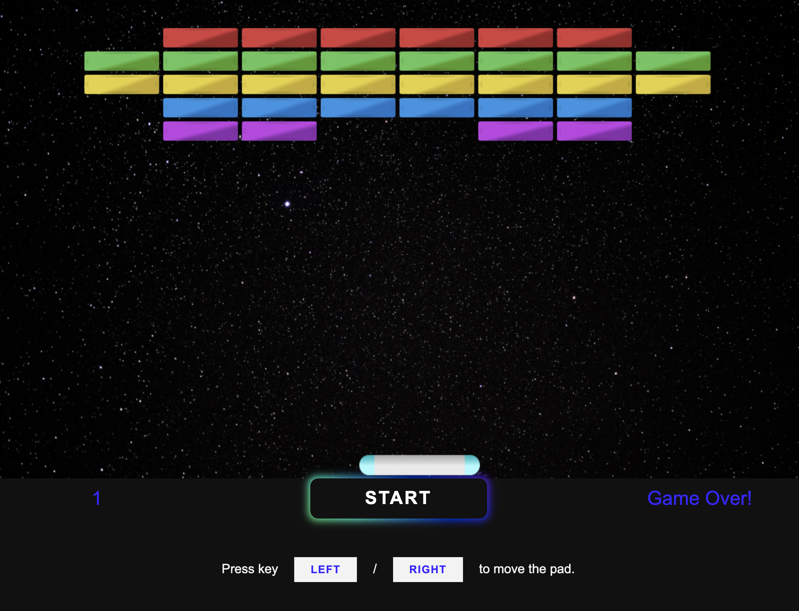

# Arkanoid desktop game

[Demo app](https://arkanoid-game-2d.netlify.app/)

### Screenshot

Desktop game app with vanilla TypeScript and classic user interface. This app were meant for me to learn Typescript along the way while building the game. Thanks to Thomas (instructor) who explained the usage and implementation of typescript language in such a simple way

Credit: [Weibenfalk](https://www.youtube.com/channel/UCnnnWy4UTYN258FfVGeXBbg)
